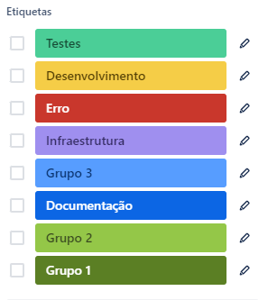
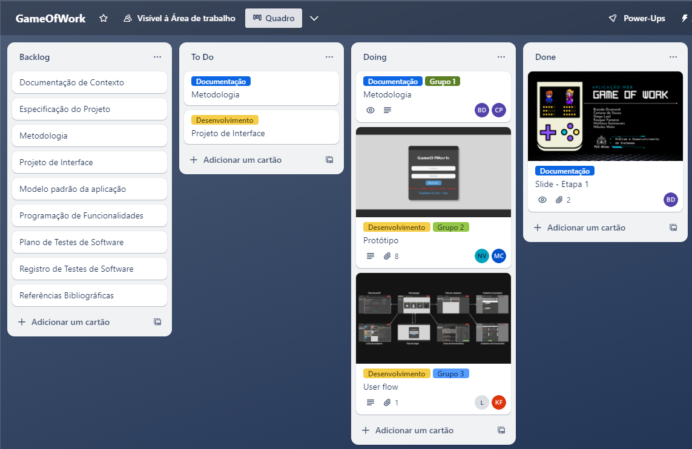

# Metodologia

## Gerenciamento de Projeto
A metodologia ágil escolhida para o desenvolvimento deste projeto é o Scrum, que se concentra no trabalho em equipe, melhoria contínua e outros princípios originados do Manifesto Ágil.
Além disso, estamos utilizando o Kanban como complemento, segundo Anderson (2010), criador do método,  “o Kanban proporciona uma visão clara e transparente do fluxo de trabalho, permitindo que as equipes identifiquem e resolvam gargalos de forma proativa".

Neste sentido, estamos aproveitando sua vantagem de fornecer uma visualização clara e em tempo real do fluxo de trabalho. Permitindo que toda a equipe e que as partes interessadas acompanhem o status e o progresso das tarefas de forma eficiente.

### Divisão de Papéis

No que diz respeito ao desenvolvimento do projeto via Scrum, a equipe está organizada da seguinte maneira:

- Scrum Master: Nikolas Mota.
- Product Owner: Diego Leal.
- Equipe de Desenvolvimento: Brenda Drumond, Catiane de Souza, Diego Leal, Kayque Fonseca, Matheus Guimaraes e Nikolas Mota.
- Equipe de Design: Brenda Drumond, Catiane de Souza, Diego Leal, Kayque Fonseca, Matheus Guimaraes e Nikolas Mota.

### Processo

Para organizar, distribuir e colaborar nas tarefas do projeto, nossa equipe está utilizando o Trello como ferramenta principal. Abaixo, fornecemos uma visão detalhada de como estamos usando o Trello para gerenciar nosso trabalho:

  **Quadros**: Os quadros no Trello representam nossos projetos ou iniciativas. Eles são a camada mais alta de organização e podem conter várias listas, cada uma representando uma fase ou etapa do nosso processo de trabalho.
  
  **Listas**: Nossas listas estão divididas em quatro etapas principais: "Product Backlog”, “To Do”, “Doing” e “Done”.
  
  **Cartões**: Utilizamos cartões no Trello para representar as diferentes tarefas e atividades do projeto. Cada cartão é uma unidade individual de trabalho e contém detalhes relevantes, como descrição da tarefa, prazos, anexos e links úteis. 
  
  **Etiquetas**: As tarefas são etiquetadas em função da natureza da atividade e seguem o seguinte esquema de cores/categorias:

- Grupo 1
- Grupo 2
- Grupo 3
- Testes Desenvolvimento
- Erro
- Infraestrutura
- Documentação

<figure> 
  Figura 1: Legenda Etiquetas - Trello</figcaption>
</figure> 

O quadro kanban do grupo no Trello está disponível no link https://trello.com/b/QLNL5JT6/gameofwork e é apresentado, no estado atual, na figura abaixo:

<figure> 
  Figura 2: Tela Inicial - Trello</figcaption>
</figure> 

### Ferramentas

As ferramentas empregadas no projeto são:
  - Repositório de código
  - Ferramentas de gerenciamento do projeto
  - Ferramentas de desenho de tela 

O repositório de código é uma ferramenta essencial para qualquer projeto de desenvolvimento de software. Ele fornece um ambiente onde os desenvolvedores podem escrever, editar e depurar o código-fonte do aplicativo. As ferramentas de gerenciamento desempenham um papel fundamental na colaboração eficaz da equipe, especialmente em projetos distribuídos ou remotos. Essas ferramentas permitem que a equipe atue de forma colaborativa na organização, no gerenciamento do tempo e comunicação. 

As ferramentas de desenho de tela, também conhecidas como ferramentas de wireframing, são utilizadas para criar esboços e protótipos de interfaces de usuário. Elas permitem que os designers visualizem e comuniquem suas ideias de design de forma rápida e eficiente. O Figma é uma das ferramentas mais populares nesta categoria, oferecendo recursos poderosos para criar wireframes, protótipos interativos e colaborar em tempo real com outros membros da equipe.

Os artefatos do projeto são desenvolvidos a partir das plataformas GitHub, Trello e Figma, apresentadas com seu propósito na tabela que se segue.

| AMBIENTE                            | PLATAFORMA                         | LINK DE ACESSO                         |
|-------------------------------------|------------------------------------|----------------------------------------|
| Repositório de código fonte         | GitHub                             | https://github.com/orgs/ICEI-PUC-Minas-PMV-ADS/teams/game-of-work                  |
| Documentos do projeto               | GitHub                             | https://github.com/orgs/ICEI-PUC-Minas-PMV-ADS/teams/game-of-work                  |
| Projeto de Interface                | Figma                              | https://www.figma.com/files/project/221108630/Team-project?fuid=1360379528622743875|
| Gerenciamento do Projeto            | GitHub Projects e Trello           | https://trello.com/c/hm4FWjKb/7-prot%C3%B3tipo                                     |

### Estratégia de Organização de Codificação 

Todos os artefatos relacionados a implementação e visualização dos conteúdos do projeto do site deverão ser inseridos na pasta [codigo-fonte](https://github.com/ICEI-PUC-Minas-PMV-ADS/pmv-ads-2024-1-e1-proj-web-t13-game-of-work/tree/7d697726454626d0538ed08e0c1a4b2bdcedd7e0/codigo-fonte). Consulte também a nossa sugestão referente a estratégia de organização de codificação a ser adotada pela equipe de desenvolvimento do projeto.
