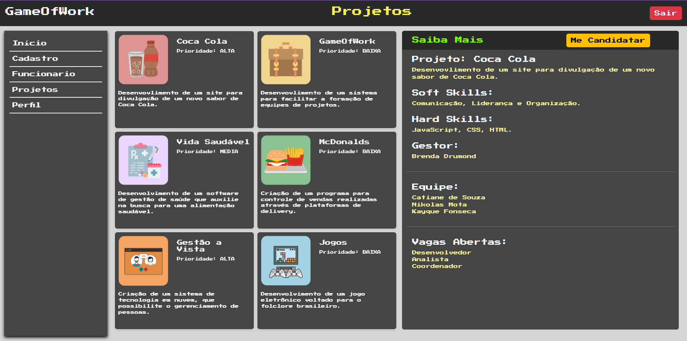

# Projeto de Interface

## User Flow

O fluxograma apresentado na imagem abaixo mostra o fluxo de interação do usuário pelas telas do sistema. Cada uma das telas deste fluxo é detalhada na seção de Protótipo de baixa fidelidade que se segue.

<figure> 
    
    <figcaption>Fluxo de telas do usuário
</figure>  

### Protótipo de baixa fidelidade

As telas do sistema apresentam uma estrutura  que é apresentada na imagem abaixo. Nesta estrutura existem 3 grandes blocos, descritos a seguir. São eles:

<ul>
  <li>Cabeçalho - local onde estão dispostos o nome da aplicação web, o nome da página e a opção de sair;</li>
  <li>Conteúdo - apresenta o conteudo da tela em questão;</li>
  <li>Menu - Menu de navegação do site.</li>
</ul>

<figure> 
  
    <figcaption>Protótipo do site
</figure> 

<h3><b>Tela - Login</b></h3>

A tela de Login apresenta campos para a inserção do e-mail e da senha, e a funcionalidade de se cadastrar.

<figure> 
  
    <figcaption>Tela - Lista de projetos
</figure>

 

<h3><b>Tela - Home page</b></h3>

A tela de home page apresenta opções para o usuário acessar as outras tela da aplicação. 

<figure> 
  
    <figcaption>Tela - Home page
</figure>

 

<h3><b>Tela - Cadastro</b></h3>

Tela acessível somente a gestores de projetos ou funcionários do RH. Essa página permite ao usuário adicionar ou deletar um funcionário ou um projeto.

<figure> 
  
    <figcaption>Tela - Cadastro
</figure>

<h4><b>Modal - Cadastro de funcionário</b></h4>

<figure> 
  
    <figcaption>Modal - Cadastro de funcionário
</figure>

<h4><b>Modal - Cadastro de projeto</b></h4>

<figure> 
  
    <figcaption>Modal - Cadastro de projeto
</figure>

 

<h3><b>Tela - Perfil</b></h3>

Tela que permite o usuário visualizar seu perfil

<figure> 
  
    <figcaption>Tela - Perfil
</figure>

 

<h3><b>Tela - Lista de projetos</b></h3>

Permite a visualização de uma lista que contém todos os projetos cadastrados no sistema, juntamente com os requisitos para participar daquele projeto.

<figure> 
  
    <figcaption>Tela - Lista de projetos
</figure>

 

<h3><b>Tela - Lista de funcionários</b></h3>

Permite a visualização de uma lista que contém todos os funcionários cadastrados no sistema.Permite também cadastrar funcionários em um projeto

<figure> 
  
    <figcaption>Tela - Lista de projetos
</figure>

