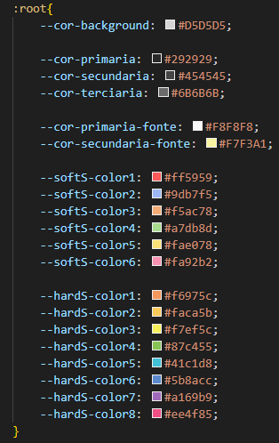

# Template padrão da Aplicação

O layout padrão do site foi construído com as linguagens de marcação HTML e CSS, a linguagem de programação JavaScript foi utilizada para a 
inserção de elementos dinamicamente e o LocalStorage foi usado para persistêcia de dados.

As páginas terão como elementos padrões o menu de navegação, que engloba o cabeçalho da paágina e o menu lateral, além dos elementos de identidade visual citados abaixo:

<ul>
<li>Cores parões:\
    <figure> 
    \
    <figcaption> Cores padrões usadas no sistema.
    </figure> 
</li>

<li>Fonte padrão: "Press Start 2P".</li>
</ul>

O código utilizado para a construção dos elementos citados pode ser consultado <a href="https://github.com/ICEI-PUC-Minas-PMV-ADS/ads-e1-exemplo-vida-de-estudante/tree/main/codigo-fonte">aqui</a>. As imagens e ícones utilizados no projeto estão disponíveis <a href="https://github.com/ICEI-PUC-Minas-PMV-ADS/ads-e1-exemplo-vida-de-estudante/tree/main/codigo-fonte/icones">aqui</a>.

<h3><b>Tela de login</b></h3>

Exibe um formulário em que o usário pode preencher com seu email e senha para fazer o login no sistema.

<figure> 
  
  <figcaption>Tela de login
</figure> 

<h3><b>Tela de cadastro</b></h3>

Exibe um formulário para o usuário se cadastrar no sistema caso ele não possua uma conta.

<figure> 
  
  <figcaption>Tela de cadastro
</figure> 

<h3><b>Tela inicial</b></h3>

Exibe cartões que ao serem clicados redireciona o usuário para as respectivas telas representadas nesses cartões.

<figure> 
  
  <figcaption>Tela inicial
</figure> 

<h3><b>Tela de perfil</b></h3>

Exibe os dados do usuário que está atualmente logado no sistema.

<figure> 
  
  <figcaption>Tela de perfil
</figure> 

<h3><b>Tela lista de funcionários</b></h3>

Exibe todos funcionários e os dados desses funcionários que estão cadastrados no sistema.

<figure> 
  
  <figcaption>Tela lista de funcionários
</figure> 

<h3><b>Tela cadastro de projetos</b></h3>

Exibe botões que permitem: cadastrar um projeto, excluir um projeto, editar um usuário ou excluir um usuário.

<figure> 
  
  <figcaption>Tela cadastro de projetos.
</figure>
<figure> 
  
  <figcaption>Modal de cadastro de projeto.
</figure>  

  

O logotipo do sistema é "GameOfWork" escrito com a fonte "Press Start 2P" e na cor: #F8F8F8.

<figure> 
  
    <figcaption>Logotipo da aplicação web GameOfWork
</figure> 