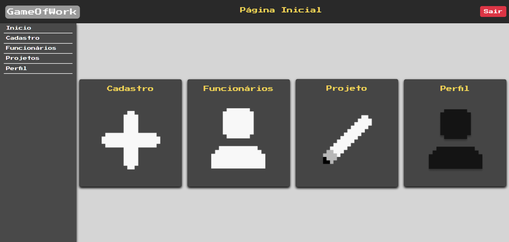
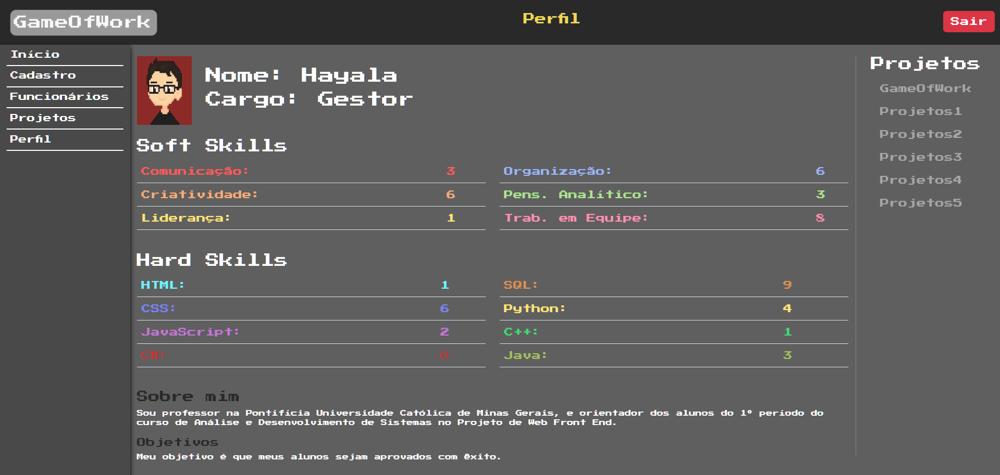

# Programação de Funcionalidades

Implementação da aplicação descritas por meio dos requisitos codificados. 

### Tela Página Inicial

<figure> 
  Figura 1: Tela Página Inicial</figcaption>
</figure>

#### Requisito atendido

- RF- 02: Local de navegação intuitivo sem dificuldade de entendimento

#### Artefatos da funcionalidade

- index_pagina_inicial.html
- style_pagina_inicial.css
- mobile-navbar.js

#### Estrutura de Dados

- index_pagina_inicial.html
  

#### Instruções de acesso

Abra um navegador de Internet e informe a seguinte URL: link

Ao clicar em “Inicio” no canto superior direito da tela, terá acesso a página de inicio, onde pode localizar o caminho para cadastro e visualização de funcionários, projetos e perfil

#### Responsável

Brenda Drumond

### Tela Perfil

<figure> 
  Figura 2: Tela de Perfil</figcaption>
</figure> 

#### Requisito atendido

- RF-04	Na ficha do funcionário, deve ter um local para colocar o nível de cada competência.
- RF-05	Na ficha do funcionário, deve ter uma imagem/avatar do mesmo.
- RF-07	Deve conter área para as formações acadêmicas (fora o conhecimento adquirido técnico).
- RF-06	Na ficha do funcionário, deve ter seu objetivo profissional.
- RF-08	Deve conter um breve resumo sobre o funcionário.
- RF-09	Opção de demonstrar os projetos que o funcionário participou anteriormente.

#### Artefatos da funcionalidade

- index_tela_perfil.html
- style_tela_perfil.css
- mobile-navbar.js

#### Estrutura de Dados

- index_tela_perfil.html
  

#### Instruções de acesso

Abra um navegador de Internet e informe a seguinte URL: link

Ao clicar em “Perfil” no canto superior direito da tela, terá acesso a página de perfil, onde pode visualizar seu perfil, avatar, habilidades e projetos escalados ou gerenciados etc.

#### Responsável

Catiane de Souza

