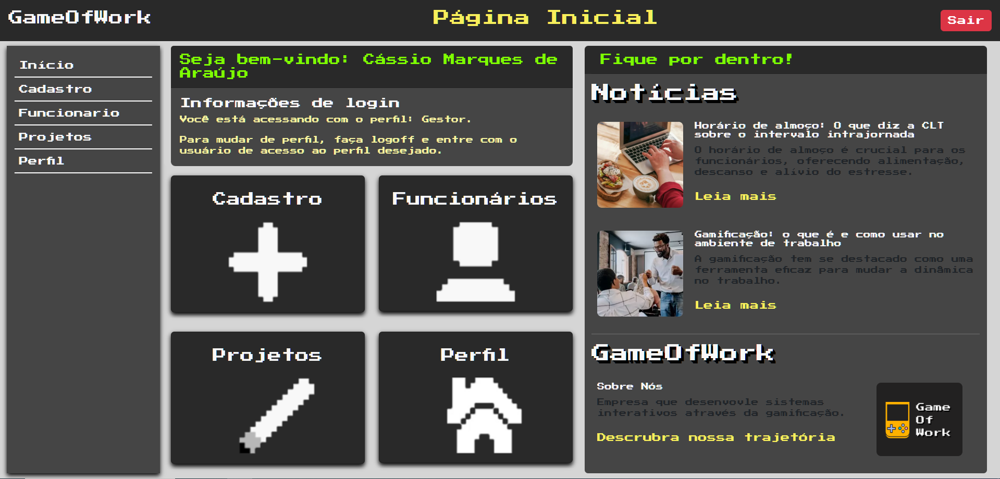

# Programação de Funcionalidades

Implementação da aplicação descritas por meio dos requisitos codificados. 

### Tela Página Inicial

<figure> 
  
  <figcaption>Figura 1: Tela Página Inicial</figcaption>
</figure>

#### Requisito atendido

- RF- 02: Local de navegação intuitivo sem dificuldade de entendimento.
- RF- 01: Tela de login, com acesso diferente para cada perfil de usuário.

#### Artefatos da funcionalidade

- index_pagina_inicial.html
- style_pagina_inicial.css
- script_pagina_inicial.js

#### Estrutura de Dados

- index_pagina_inicial.html
  

#### Instruções de acesso

Clique<a href="https://icei-puc-minas-pmv-ads.github.io/pmv-ads-2024-1-e1-proj-web-t13-game-of-work/codigo-fonte/paginaInicial/index_pagina_inicial.html">AQUI</a>

Ao clicar em “Inicio” no canto superior direito da tela, terá acesso a página de inicio, onde pode localizar o caminho para cadastro e visualização de funcionários, projetos e perfil.

#### Responsável

Brenda Drumond

### Tela Perfil

<figure> 
  
  <figcaption>Figura 2: Tela de Perfil</figcaption>
</figure> 

#### Requisito atendido

- RF-04	Na ficha do funcionário, deve ter um local para colocar o nível de cada competência.
- RF-05	Na ficha do funcionário, deve ter uma imagem/avatar do mesmo.
- RF-07	Deve conter área para as formações acadêmicas (fora o conhecimento adquirido técnico).
- RF-06	Na ficha do funcionário, deve ter seu objetivo profissional.
- RF-08	Deve conter um breve resumo sobre o funcionário.
- RF-09	Opção de demonstrar os projetos que o funcionário participou anteriormente.
- RF-16 Exibir ficha do funcionário.
- RF-18 O usuário deve poder acessar o seu perfil para visualizar suas competências.

#### Artefatos da funcionalidade

- index_tela_perfil.html
- style_tela_perfil.css
- script_tela_perfil.js

#### Estrutura de Dados

- index_tela_perfil.html
  

#### Instruções de acesso

Clique<a href="https://icei-puc-minas-pmv-ads.github.io/pmv-ads-2024-1-e1-proj-web-t13-game-of-work/codigo-fonte/paginaInicial/index_pagina_inicial.html">AQUI</a>

Ao clicar em “Perfil” no canto superior direito da tela, terá acesso a página de perfil, onde pode visualizar seu perfil, avatar, habilidades e projetos escalados ou gerenciados etc.

#### Responsável

Catiane de Souza

### Tela Login

<figure> 
  
  <figcaption>Figura 3: Tela de Login</figcaption>
</figure> 

#### Requisito atendido

- RF-01 Tela de login, com acesso diferente para cada perfil de usuário.

#### Artefatos da funcionalidade

- telaLogin.html
- telaLogin.css

#### Estrutura de Dados

- telaLogin.html
  

#### Instruções de acesso

Clique<a href="">AQUI</a>

Digite um email e senha cadastrado para fazer o login. Caso não possua uma conta clique em cadastre-se.

#### Responsável

Kayque Fonseca

### Tela Lista de Funcionários

<figure> 
  
  <figcaption>Figura 4: Tela Lista de Funcionários</figcaption>
</figure> 

#### Requisito atendido

- RF-15 Deve exibir uma lista com os funcionários cadastrados.
- RF-16 Exibir ficha do funcionário.

#### Artefatos da funcionalidade

- listaFuncionarios.html
- listaFuncionarios.css
- listaFuncionarios.js

#### Estrutura de Dados

- listaFuncionarios.html
  

#### Instruções de acesso

Clique<a href="https://icei-puc-minas-pmv-ads.github.io/pmv-ads-2024-1-e1-proj-web-t13-game-of-work/codigo-fonte/paginaInicial/index_pagina_inicial.html">AQUI</a>

Clique na opção "Funcionários" no menu lateral à esquerda. Para ver os dados de um funcionário basta clicar em seu card na lista.

#### Responsável

Nikolas Victor Mota

### Tela Lista de Projetos

<figure> 
  
  <figcaption>Figura 5: Tela Lista de Projetos</figcaption>
</figure> 

#### Requisito atendido

- RF-10	Tem que ser possível selecionar os projetos que estão em prioridade por conta de prazo.
- RF-15 Deve exibir uma lista com os projetos cadastrados.
- RF-14	Deve permitir que faça o cadastro de um projeto.
- RF-20	Deve exibir uma lista com os projetos cadastrados.
- RF-21	Deve exibir quais funcionários estão participando de um projeto.

#### Artefatos da funcionalidade

- listaProjetos.html
- listaProjetos.css
- listaProjetos.js
  

#### Estrutura de Dados

- listaProjetos.html
  

#### Instruções de acesso

Clique<a href="https://icei-puc-minas-pmv-ads.github.io/pmv-ads-2024-1-e1-proj-web-t13-game-of-work/codigo-fonte/paginaInicial/index_pagina_inicial.html">AQUI</a>

Clique na opção "Projetos" no menu lateral à esquerda.
Selecione na lista ao lado esquerdo da tela o Projeto que deseje mas detalhes, as informações do Projeto serão exibidas no lado direito da tela. 

#### Responsável

Brenda Drumond e Catiane de Souza.

### Tela Cadastro de funcionários 

<figure> 
  
  <figcaption>Figura 6: Tela Lista de Funcionários</figcaption>
</figure> 

#### Requisito atendido

- RF-02	Local de navegação intuitivo sem dificuldade de entendimento.
- RF-06	Na ficha do funcionário, deve ter seu objetivo profissional.
- RF-08	Deve conter um breve resumo sobre o funcionário.
- RF-04 Na ficha do funcionário, deve ter um local para colocar o nível de cada competência.
- RF-12 Deve permitir que faça o cadastro de um usuário.

#### Artefatos da funcionalidade

- cadastroFuncionario.html
- cadastroFuncionario.css
- cadFuncionario.js

#### Estrutura de Dados

- cadastroFuncionario.html

#### Instruções de acesso

Clique<a href="">AQUI</a>

Faça cadastro inserindo as informações solicitadas.

#### Responsável

Kayque Fonseca

